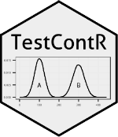

<!-- README.md is generated from README.Rmd. Please edit that file -->

```{r setup, include = FALSE, results='hide'}
knitr::opts_chunk$set(
  collapse = TRUE,
  comment = "#>",
  fig.path = "man/figures/README-",
  out.width = "100%"
)
```



# TestContR 

The primary goal of TestContR is to select randomized Test groups/individuals and matched them with Control groups/individuals using Euclidian distance. You also have the option to provide a list of test groups/individuals where by you can generate a list of control groups/individuals.


## Example

R contains a crime data set for the all 50 states.  This data set contains data on murder rates, assaults, urban 
population and the occurances of rape.  The TestContR can be used to match states that have similar crime rates.

```{r, results='hide', message=FALSE}
library(tidyverse)
library(TestContR)
```

### Random Selection of Test and Control groups/individuals
```{r example, warning=FALSE}
df <- datasets::USArrests %>% dplyr::mutate(state = base::row.names(USArrests)) %>%
                               dplyr::select(state, everything())
```

**Expected data set layout with labels/names/id in the first column:**
```{r}
knitr::kable(head(df, n = 10))
```

```{r}
set.seed(99)
TEST_CONTROL_LIST <- TestContR::match_numeric(df)
```

**Results of random selection option:**
```{r}
knitr::kable(TEST_CONTROL_LIST)
```
<br></br>

***

### Providing a list of Test Groups/Individuals
```{r}
TEST_GRP <- tribble(~'TEST','Colorado','Minnesota','Florida','South Carolina')

```

**Example of data frame for the "test_list" input parameter:**
```{r}
knitr::kable(TEST_GRP)
```


```{r}
set.seed(99)
TEST_CONTROL_LIST <- TestContR::match_numeric(df, test_list = TEST_GRP)
```

**Results for the "test_list" input parameter:**
```{r}
knitr::kable(TEST_CONTROL_LIST)
```

***
