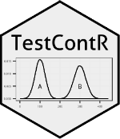

<!-- README.md is generated from README.Rmd. Please edit that file -->


TestContR 
===========================================================================

The primary goal of TestContR is to select randomized Test groups/individuals and matched them with Control groups/individuals using Euclidian distance. You also have the option to provide a list of test groups/individuals where by you can generate a list of control groups/individuals.

Example
-------

R contains a crime data set for the all 50 states. This data set contains data on murder rates, assaults, urban population and the occurances of rape. The TestContR can be used to match states that have similar crime rates.

``` r
library(tidyverse)
library(TestContR)
```

### match\_numeric(): Random Selection of Test and Control groups/individuals

``` r
df <- datasets::USArrests %>% dplyr::mutate(state = base::row.names(USArrests)) %>%
                               dplyr::select(state, everything())
```

**Expected data set layout with labels/names/id in the first column:**

``` r
knitr::kable(head(df, n = 10))
```

| state       |  Murder|  Assault|  UrbanPop|  Rape|
|:------------|-------:|--------:|---------:|-----:|
| Alabama     |    13.2|      236|        58|  21.2|
| Alaska      |    10.0|      263|        48|  44.5|
| Arizona     |     8.1|      294|        80|  31.0|
| Arkansas    |     8.8|      190|        50|  19.5|
| California  |     9.0|      276|        91|  40.6|
| Colorado    |     7.9|      204|        78|  38.7|
| Connecticut |     3.3|      110|        77|  11.1|
| Delaware    |     5.9|      238|        72|  15.8|
| Florida     |    15.4|      335|        80|  31.9|
| Georgia     |    17.4|      211|        60|  25.8|

**Build Test and Control list**

``` r
set.seed(99)
TEST_CONTROL_LIST <- TestContR::match_numeric(df)
#> [1] "The 1th de-duping iteration started"
#> Joining, by = "CONTROL"
#> Joining, by = c("CONTROL", "TEST", "DIST_Q", "GROUP")
#> [1] "The 1th de-duping iteration complete."
#> [1] "The 2th de-duping iteration started"
#> Joining, by = "CONTROL"
#> Joining, by = c("CONTROL", "TEST", "DIST_Q", "GROUP")
#> [1] "The 2th de-duping iteration complete."
```

**Results of random selection option:**

``` r
knitr::kable(TEST_CONTROL_LIST)
```

| CONTROL        | TEST           |    DIST\_Q|  GROUP|
|:---------------|:---------------|----------:|------:|
| Michigan       | Colorado       |  1.2363108|      1|
| Oklahoma       | Delaware       |  1.1802929|      2|
| New York       | Illinois       |  0.3502188|      3|
| Indiana        | Kansas         |  0.4287712|      4|
| Texas          | Missouri       |  1.1654171|      5|
| Massachusetts  | New Jersey     |  0.7977642|      6|
| South Carolina | North Carolina |  1.0476313|      7|
| Ohio           | Utah           |  1.0154223|      8|
| Oregon         | Washington     |  0.5935343|      9|
| Virginia       | Wyoming        |  0.7038309|     10|
| <br></br>      |                |           |       |

------------------------------------------------------------------------

#### Providing a list of Test Groups/Individuals

``` r
TEST_GRP <- tribble(~'TEST','Colorado','Minnesota','Florida','South Carolina')
```

**Example of data frame for the "test\_list" input parameter:**

``` r
knitr::kable(TEST_GRP)
```

| TEST           |
|:---------------|
| Colorado       |
| Minnesota      |
| Florida        |
| South Carolina |

``` r
set.seed(99)
TEST_CONTROL_LIST <- TestContR::match_numeric(df, test_list = TEST_GRP)
#> Warning in if (test_list == "NULL") {: the condition has length > 1 and
#> only the first element will be used
```

**Results for the "test\_list" input parameter:**

``` r
knitr::kable(TEST_CONTROL_LIST)
```

| CONTROL     | TEST           |    DIST\_Q|  GROUP|
|:------------|:---------------|----------:|------:|
| Michigan    | Colorado       |  1.2363108|      1|
| New Mexico  | Florida        |  1.2965798|      2|
| Wisconsin   | Minnesota      |  0.4940832|      3|
| Mississippi | South Carolina |  0.7865674|      4|

------------------------------------------------------------------------

------------------------------------------------------------------------

### topn\_numeric(): Select Top N Controls for a group or individual

Topn\_numeric() is used in the situation where you have 1 test group/individual and you are looking for Top N nearest matches using Euclidian distance. - Note: You can provide more than one group, but the function does not remove duplicates in the control list for the more than 1 group or individual. First, create a dataframe (1x1) as below with the label of the group/individual of interest.

``` r
test_list <- tribble(~"TEST","Colorado")
```

**Build the list of Top N matches ** Provide the test\_list dataframe to the test\_list parameter in the function as below.

``` r
TOPN_CONTROL_LIST <- TestContR::topn_numeric(df, n = 10, test_list = test_list)
```

**Results of Top N selection option:**

``` r
knitr::kable(TOPN_CONTROL_LIST)
```

| CONTROL    | TEST     |   DIST\_Q|  DIST\_RANK|
|:-----------|:---------|---------:|-----------:|
| Michigan   | Colorado |  1.236311|           1|
| California | Colorado |  1.287618|           2|
| Missouri   | Colorado |  1.312741|           3|
| Arizona    | Colorado |  1.365031|           4|
| Nevada     | Colorado |  1.398859|           5|
| Oregon     | Colorado |  1.533198|           6|
| New Mexico | Colorado |  1.546744|           7|
| New York   | Colorado |  1.736339|           8|
| Washington | Colorado |  1.789792|           9|
| Illinois   | Colorado |  1.789832|          10|
| <br></br>  |          |          |            |

------------------------------------------------------------------------
